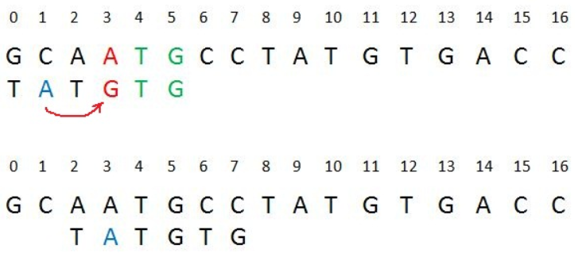

# Boyer Moore Algorithm for Pattern Searching

Given a text txt[0..n-1] and a pattern pat[0..m-1] where n is the length of the text and m is the length of the pattern, write a function search(char pat[], char txt[]) that prints all occurrences of pat[] in txt[]. You may assume that n > m. 

Example:
<pre>
Input:  txt[] = "THIS IS A TEST TEXT"
        pat[] = "TEST"
Output: Pattern found at index 10

Input:  txt[] =  "AABAACAADAABAABA"
        pat[] =  "AABA"
Output: Pattern found at index 0
        Pattern found at index 9
        Pattern found at index 12
</pre>

Boyer Moore is a combination of the following two approaches. 
- 1. Bad Character Heuristic 
- 2. Good Suffix Heuristic 

## Bad Character Heuristic 

It processes the pattern and creates different arrays for each of the two heuristics. At every step, it slides the pattern by the max of the slides suggested by each of the two heuristics. So it uses greatest offset suggested by the two heuristics at every step. 

Unlike the previous pattern searching algorithms, the Boyer Moore algorithm starts matching from the last character of the pattern.

##Bad Character Heuristic 
The character of the text which doesn’t match with the current character of the pattern is called the Bad Character. Upon mismatch, we shift the pattern until – 
- 1) The mismatch becomes a match
- 2) Pattern P moves past the mismatched character.

### Case 1

### Case 2

## Good Suffix Heuristic 
Let t be substring of text T which is matched with substring of pattern P. Now we shift pattern until :
- 1. Another occurrence of t in P matched with t in T.
- 2. A prefix of P, which matches with suffix of t
- 3. P moves past t

### Case 1: Another occurrence of t in P matched with t in T

### Case 2: A prefix of P, which matches with suffix of t in T

### Case 3: P moves past t
